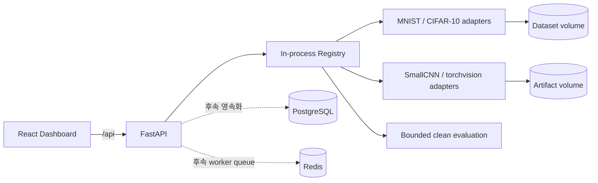

# AIShield

> PyTorch 이미지 분류 모델의 적대적 강건성을 안전하고 재현 가능하게 평가하는
> AI Security 연구 플랫폼

[](https://github.com/MintKangaroo/AIShield/actions/workflows/ci.yml)


AIShield는 공격 성공률 하나만으로 모델 보안을 판단하지 않습니다. 동일한 데이터셋,
모델, seed, 공격 파라미터와 실행 환경을 다시 구성할 수 있도록 실험 근거를 남기고,
`clean accuracy`와 `robust accuracy`를 함께 비교하는 것을 기본 원칙으로 삼습니다.

현재 `develop` 기준으로 **2단계 모델·데이터셋 레지스트리**까지 구현되어 있습니다.
상세 clean baseline, 적대적 공격과 방어 실행은 이후 단계에서 순차적으로 추가됩니다.

## 핵심 원칙

- 모든 결과는 입력, 설정, 코드와 환경 정보로 재현할 수 있어야 합니다.
- dataset version/split/manifest와 model artifact/state hash를 기록합니다.
- 공격 평가에서는 clean accuracy와 robust accuracy를 항상 함께 제공합니다.
- 방어 효과는 adaptive attack과 transfer attack으로 다시 검증합니다.
- gradient masking 의심 신호를 강건성 향상으로 잘못 해석하지 않습니다.
- 원본 입력, perturbation, adversarial input을 비교 가능한 artifact로 남깁니다.
- 로컬 dataset 또는 코드에 명시된 승인 공개 dataset만 사용합니다.
- 집계 점수는 raw metric을 숨기지 않으며 공식과 가중치를 공개합니다.

## 현재 구현 범위

| 영역 | 제공 기능 | 상태 |
| --- | --- | --- |
| 연구 API | 버전화된 FastAPI, OpenAPI/Redoc, liveness | 완료 |
| 실험 계약 | 엄격한 Pydantic model과 생성형 JSON Schema | 완료 |
| Dataset registry | MNIST, CIFAR-10, version/split/manifest hash | 완료 |
| Model registry | SmallCNN, 제한된 torchvision adapter, checksum | 완료 |
| 재현성 | Python/NumPy/PyTorch seed와 deterministic algorithm | 완료 |
| 기본 평가 | 등록 model/dataset 호환성, clean accuracy/loss | 제한 제공 |
| Clean baseline | confusion matrix, class metric, latency, artifact | 다음 단계 |
| 공격/방어 | FGSM, PGD, 추가 공격, defense 평가 | 예정 |
| Dashboard | API 상태와 향후 실험 화면을 위한 React 골격 | 기본 골격 |
| LLM Security | 실행 엔진과 분리된 인터페이스/로드맵 | 10단계 문서화 |

현재 SmallCNN은 seed로 초기화하거나 사용자가 허용된 model root에 둔 weights-only
checkpoint에서 복원합니다. 학습되지 않은 모델의 정확도는 보안 성능을 의미하지 않으며,
연구 결과로 사용하려면 검증된 checkpoint와 3단계 baseline 절차가 필요합니다.

## 시스템 구성



레지스트리 metadata와 runtime object는 현재 API 프로세스 메모리에 유지됩니다. API를
재시작하면 등록 항목은 사라지지만 dataset과 model artifact 파일은 Docker volume 또는
설정한 로컬 경로에 남습니다. PostgreSQL 영속화와 Redis worker는 다음 구현 단계에서
연결할 수 있도록 Compose 서비스와 도메인 경계를 먼저 준비했습니다.

## 빠른 시작

### Docker CPU 데모

필수 조건:

- Docker Engine
- Docker Compose plugin
- 최초 이미지 빌드와 공개 dataset 사용 시 인터넷 연결

```bash
cp .env.example .env
docker compose up --build --wait
```

기본 접속 주소:

| 서비스 | 주소 |
| --- | --- |
| Dashboard | <http://localhost:3000> |
| Swagger UI | <http://localhost:8000/api/docs> |
| ReDoc | <http://localhost:8000/api/redoc> |
| Liveness | <http://localhost:8000/api/v1/health/live> |

```bash
curl http://localhost:8000/api/v1/health/live
```

정상 응답 예시:

```json
{
  "status": "ok",
  "service": "aishield-api",
  "version": "0.1.0",
  "environment": "development",
  "compute_device": "cpu"
}
```

호스트 포트가 이미 사용 중이면 `.env`에서 포트만 변경합니다.

```dotenv
AISHIELD_API_PORT=18000
AISHIELD_DASHBOARD_PORT=13000
```

서비스 내부 포트와 nginx의 `/api` proxy는 그대로 유지됩니다. 데이터 volume을
보존하면서 종료하려면 다음 명령을 사용합니다.

```bash
docker compose down
```

`docker compose down --volumes`는 내려받은 dataset과 model artifact를 포함한 AIShield
volume도 삭제하므로, 실험 자료가 필요하지 않을 때만 사용하십시오.

### 선택적 GPU 환경 점검

기본 API image는 재현 가능한 CPU 실행을 위해 PyTorch `2.13.0`과 torchvision `0.28.0`
CPU wheel을 사용합니다. `gpu` profile은 NVIDIA Container Toolkit과 GPU 접근 가능 여부만
확인하며, 현재 API를 CUDA worker로 전환하지 않습니다.

```bash
docker compose --profile gpu run --rm gpu-check
```

## 공개 dataset과 pretrained weight 승인

외부 다운로드는 기본적으로 차단됩니다.

```dotenv
AISHIELD_ALLOW_PUBLIC_DOWNLOADS=false
```

MNIST, CIFAR-10 또는 allowlist에 포함된 공식 torchvision weight를 내려받으려면 운영자가
`.env`에서 명시적으로 승인한 뒤 서비스를 다시 시작해야 합니다.

```dotenv
AISHIELD_ALLOW_PUBLIC_DOWNLOADS=true
```

이 설정은 내장 adapter가 고정한 공식 출처에만 적용됩니다. API 사용자가 임의 URL을
입력하거나, 허용되지 않은 architecture를 요청하거나, model root 밖의 checkpoint를
불러오는 것은 허용하지 않습니다.

## 레지스트리 사용 예시

아래 예시는 공개 다운로드를 승인한 Docker 환경을 기준으로 합니다.

### 1. Dataset split 등록

```bash
curl -X POST http://localhost:8000/api/v1/registry/datasets \
  -H "Content-Type: application/json" \
  -d '{
    "name": "mnist",
    "split": "test",
    "download": true
  }'
```

응답에는 재사용할 `id`와 다음 무결성 metadata가 포함됩니다.

- 고정된 adapter version과 canonical source
- 정확한 split과 sample count
- 입력 shape와 class 수
- torchvision version과 transform
- 로컬 materialization 전체의 `manifest_sha256`

### 2. Dataset 호환 SmallCNN 등록

`<DATASET_ID>`를 이전 응답의 `id`로 바꿉니다.

```bash
curl -X POST http://localhost:8000/api/v1/registry/models/small-cnn \
  -H "Content-Type: application/json" \
  -d '{
    "dataset_id": "<DATASET_ID>",
    "seed": 1729
  }'
```

모델 응답은 framework/architecture/seed/parameter count와 함께 두 종류의 hash를
제공합니다.

- `state_dict_sha256`: serialization과 무관한 tensor 상태 fingerprint
- `artifact.sha256`: 실제 저장된 `.pt` 파일의 SHA-256

### 3. 제한된 clean 호환성 평가

`<MODEL_VERSION_ID>`와 `<DATASET_ID>`를 실제 값으로 바꿉니다.

```bash
curl -X POST http://localhost:8000/api/v1/registry/evaluations \
  -H "Content-Type: application/json" \
  -d '{
    "model_version_id": "<MODEL_VERSION_ID>",
    "dataset_id": "<DATASET_ID>",
    "seed": 1729,
    "batch_size": 64,
    "max_samples": 512
  }'
```

공격을 실행하지 않은 결과는 robust accuracy를 0으로 꾸미지 않습니다.

```json
{
  "clean_accuracy": 0.1,
  "robust_accuracy": null,
  "robust_accuracy_status": "not_evaluated"
}
```

위 값은 응답 구조를 설명하기 위한 예시입니다. 실제 정확도와 loss는 모델 checkpoint,
dataset materialization과 평가 표본에 따라 달라집니다.

## API 요약

| Method | Endpoint | 설명 |
| --- | --- | --- |
| `GET` | `/api/v1` | 서비스 metadata |
| `GET` | `/api/v1/health/live` | 프로세스 liveness |
| `POST` | `/api/v1/registry/datasets` | 승인 dataset split 로드 |
| `GET` | `/api/v1/registry/datasets` | 현재 프로세스의 dataset 목록 |
| `POST` | `/api/v1/registry/models/small-cnn` | SmallCNN 생성/checkpoint 복원 |
| `POST` | `/api/v1/registry/models/torchvision` | allowlist torchvision model 로드 |
| `GET` | `/api/v1/registry/models` | 현재 프로세스의 model 목록 |
| `POST` | `/api/v1/registry/evaluations` | 제한된 clean 호환성 평가 |

요청과 응답의 전체 계약은 실행 중인 Swagger UI 또는 [API 문서](docs/api.md)에서 확인할
수 있습니다. 모든 request model은 알 수 없는 field를 거부해 파라미터 오타가 조용히
무시되지 않게 합니다.

## 로컬 개발

지원 환경:

- Python 3.11 또는 3.12
- Node.js 22
- CPU 기본 지원

```bash
python -m venv .venv
source .venv/bin/activate
python -m pip install torch==2.13.0 torchvision==0.28.0 \
  --index-url https://download.pytorch.org/whl/cpu
python -m pip install -e ".[dev,ml]"
make check
```

API 실행:

```bash
source .venv/bin/activate
aishield-api
```

Dashboard 실행:

```bash
npm --prefix web ci
npm --prefix web run dev
```

Vite 개발 서버는 기본적으로 `/api` 요청을 `localhost:8000`으로 전달합니다.

## 품질 검사

백엔드 전체 검사:

```bash
make check
```

개별 명령:

```bash
python -m ruff check .
python -m ruff format --check .
python -m mypy .
python -m pytest
python -m aishield.schemas.export \
  --check schemas/experiment-result.schema.json
```

프런트엔드와 Compose 검사:

```bash
npm --prefix web run check
npm --prefix web run build
docker compose config --quiet
docker compose --profile gpu config --quiet
```

GitHub Actions는 Python 3.11/3.12 backend, React build, 실제 Docker CPU demo를 각각
검증합니다. 현재 test suite는 39개 테스트와 90% 이상의 line coverage gate를 사용합니다.

## 재현성과 무결성

AIShield가 고정하거나 기록하는 항목:

- Python `random`, NumPy, PyTorch CPU와 모든 CUDA device seed
- deterministic PyTorch algorithm, cuDNN deterministic mode와 benchmark 비활성화
- dataset 이름/version/split/sample count/transform/torchvision version
- dataset directory의 정렬된 path/size/content manifest hash
- model architecture/framework/version/seed/preprocessing/device
- tensor 이름/dtype/shape/raw bytes 기반 canonical model state hash
- 실제 model artifact URI/size/SHA-256
- 평가 seed, 표본 수, clean accuracy, loss와 robust 평가 상태

GPU kernel이나 dependency가 달라지면 수치 차이가 생길 수 있으므로 후속 실험 결과는
OS/platform, dependency, device, Git commit과 container digest까지 포함하도록 설계합니다.
정책 전문은 [재현성 정책](docs/reproducibility.md)을 참고하십시오.

## 보안 경계

- checkpoint는 configured model root 아래의 상대 경로만 허용합니다.
- symlink와 path traversal을 거부합니다.
- `torch.load(..., weights_only=True)`로 tensor state dictionary만 받습니다.
- checkpoint shape와 key는 model에 strict하게 일치해야 합니다.
- CUDA 요청 시 GPU가 없으면 CPU로 조용히 대체하지 않고 실패합니다.
- 원본 dataset, 내려받은 weight, model artifact와 실험 결과는 Git에 포함하지 않습니다.
- `.env`와 credential이 포함된 URI는 커밋하지 않습니다.

이 플랫폼은 소유하거나 명시적으로 평가 승인을 받은 model과 dataset에만 사용해야 합니다.
현재 범위에는 LLM 공격, 개인정보 공격, model extraction 실행 기능이 포함되지 않습니다.

## 디렉터리 구조

```text
.
├── compose.yaml                  # CPU 기본 / 선택적 GPU profile
├── docker/                       # API, dashboard image와 nginx 설정
├── docs/                         # 정책, 설계, API와 단계별 연구 문서
├── schemas/                      # 생성된 실험 결과 JSON Schema
├── src/aishield/
│   ├── api/                      # FastAPI application과 route
│   ├── core/                     # 검증된 runtime 설정
│   ├── registry/                 # dataset/model adapter, hash, 평가 service
│   └── schemas/                  # 실험 결과 domain contract
├── tests/unit/                   # 단위 및 API contract 테스트
└── web/                          # React + TypeScript dashboard
```

## 브랜치와 릴리스 운영

| 브랜치 | 용도 |
| --- | --- |
| `main` | 항상 실행 가능한 검증된 안정 버전 |
| `develop` | 다음 릴리스 기능을 모으는 통합 브랜치 |
| `feat/<기능명>` | `develop`에서 분기하는 기능별 작업 |
| `fix/<문제명>` | 버그 수정 |
| `docs/<문서명>` | 문서만 변경 |

기능·수정·문서 브랜치는 자동 검사를 통과한 PR로 `develop`에 병합합니다. 전체 CPU demo까지
검증된 릴리스만 `develop`에서 `main`으로 승격합니다. 자세한 규칙은
[기여 가이드](CONTRIBUTING.md)를 참고하십시오.

## 로드맵

1. ✅ 프로젝트 초기화
2. ✅ 모델·dataset registry
3. ⏳ Clean baseline
4. ⏳ FGSM
5. ⏳ PGD
6. ⏳ BIM, DeepFool, Carlini-Wagner, AutoAttack adapter
7. ⏳ Adversarial training, TRADES, preprocessing defense 평가
8. ⏳ 투명한 Robustness Score
9. ⏳ 실험 비교와 artifact Dashboard
10. ⏳ 이미지 평가와 분리된 LLM Security 확장 인터페이스/로드맵

세부 완료 조건과 범위 경계는 [전체 로드맵](docs/roadmap.md), 현재 상태와 다음 세션의
실행 순서는 [작업 인수인계](HANDOFF.md)에서 확인할 수 있습니다.

## 관련 문서

- [작업 인수인계](HANDOFF.md)
- [아키텍처](docs/architecture.md)
- [레지스트리 설계](docs/registry.md)
- [실험 결과 스키마](docs/experiment-schema.md)
- [재현성 정책](docs/reproducibility.md)
- [위협 모델](docs/threat-model.md)
- [API](docs/api.md)
- [로드맵](docs/roadmap.md)

## 라이선스

이 프로젝트는 [MIT License](LICENSE)로 배포됩니다.
