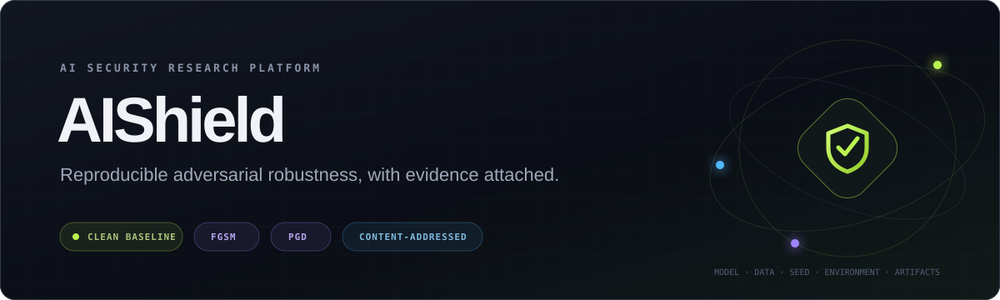
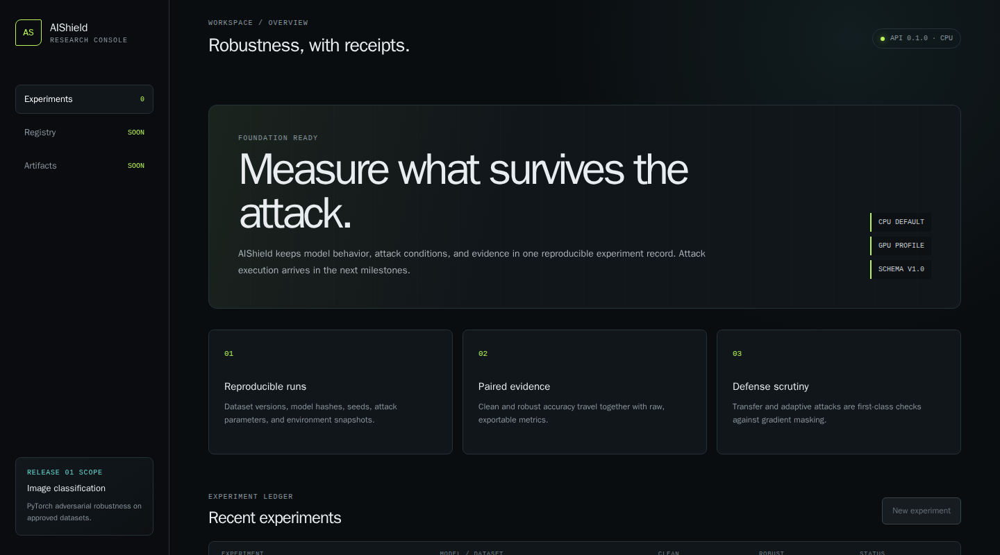
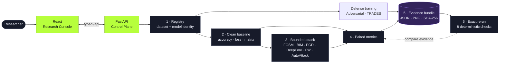
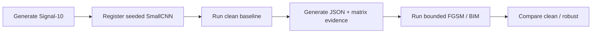
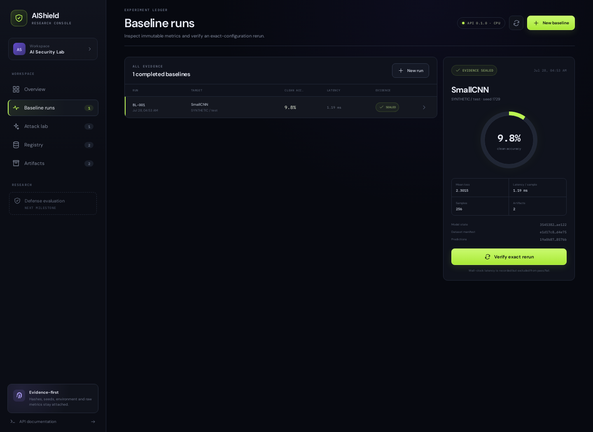
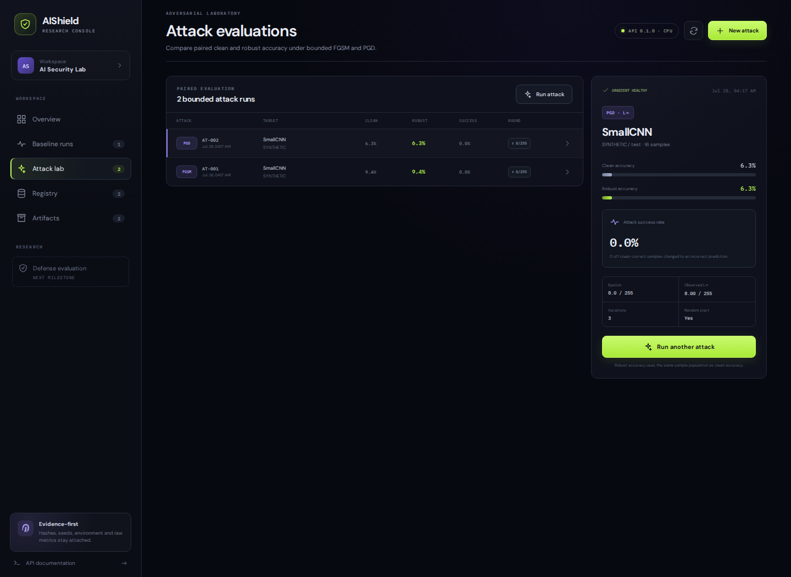
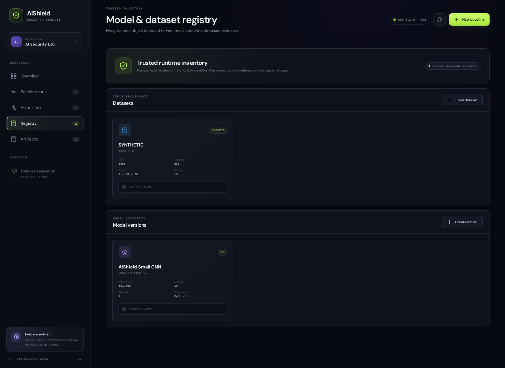
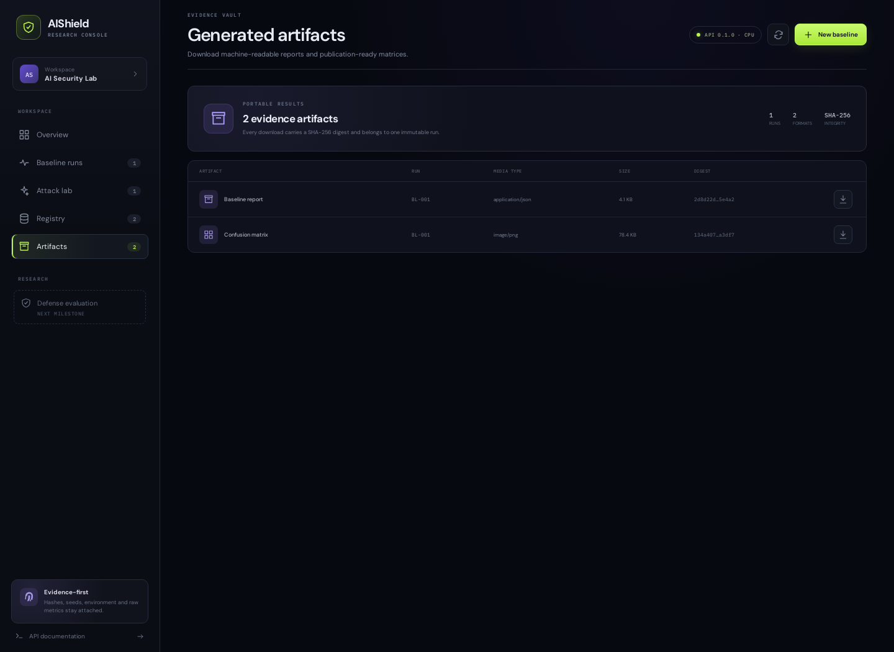
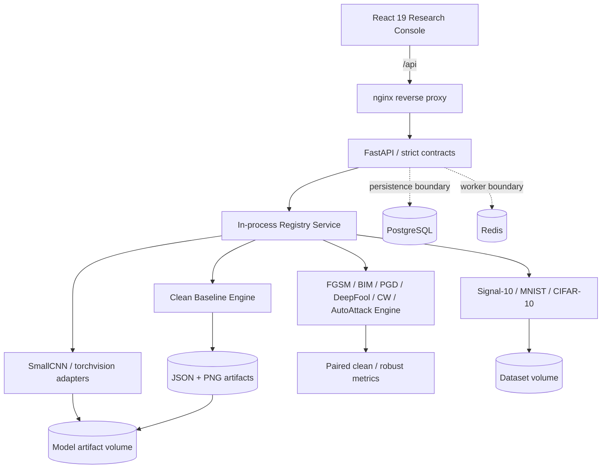

<p align="center">
  <a href="https://github.com/MintKangaroo/AIShield/actions/workflows/ci.yml"></a>
  
  
  
  
  
  <a href="LICENSE"></a>
</p>

<p align="center">
  <strong>PyTorch 이미지 분류 모델의 clean/robust 성능을 같은 표본에서 평가하고,<br>
  모델·데이터·seed·환경·결과 artifact를 하나의 재현 가능한 근거로 묶는 AI Security 연구 플랫폼</strong>
</p>

<p align="center">
  <a href="#-왜-aishield인가">Why</a> ·
  <a href="#-5분-데모">Quick start</a> ·
  <a href="#-대시보드">Dashboard</a> ·
  <a href="#-api-워크플로">API</a> ·
  <a href="#-아키텍처">Architecture</a> ·
  <a href="#-재현성과-보안-경계">Security</a> ·
  <a href="#-개발과-검증">Development</a>
</p>

---



> 위 화면은 네트워크 다운로드 없이 내장 `Signal-10` 데이터, seeded SmallCNN, clean
> baseline, bounded FGSM을 실제 API에서 실행한 결과입니다. Synthetic 데이터와 학습되지
> 않은 모델의 점수는 보안 성능 주장이 아니라 제품 흐름 검증용입니다.

## 🔎 한눈에 보는 AIShield

AIShield는 모델과 데이터의 신원을 먼저 고정한 뒤, 동일 표본에서 clean/robust 성능을
평가하고 결과를 검증 가능한 evidence bundle로 남깁니다.



| Trusted inputs | Bounded evaluation | Reproducible evidence |
| --- | --- | --- |
| Dataset manifest와 model state를 SHA-256 identity에 연결 | 같은 표본에서 clean accuracy, robust accuracy, ASR 비교 | seed, 환경, prediction hash, JSON/PNG artifact 보존 |

## 🛡️ 왜 AIShield인가

적대적 강건성 실험은 높은 숫자 하나보다 **그 숫자가 어떻게 만들어졌는지**가 더
중요합니다. 다른 데이터 split, 바뀐 checkpoint, 누락된 attack parameter, 우연히 달라진
실행 환경은 결과를 재현 불가능하게 만들 수 있습니다.

AIShield는 모든 평가에서 다음 불변식을 지킵니다.

- `clean_accuracy`와 `robust_accuracy`를 같은 표본 집합에서 함께 기록합니다.
- 공격 성공률은 clean 상태에서 맞힌 표본만 분모로 사용합니다.
- 입력을 `[0, 1]` 범위로 clamp하고 실제 perturbation의 L∞ bound를 다시 검사합니다.
- dataset manifest, model state, model artifact, ordered prediction의 SHA-256을 보존합니다.
- Python·PyTorch·torchvision·NumPy·matplotlib, OS, device, Git commit을 캡처합니다.
- 같은 설정의 재실행은 원본을 덮어쓰지 않고 별도 run으로 만든 뒤 근거를 비교합니다.
- latency는 기록하되 하드웨어 노이즈 때문에 재현성 pass/fail에서는 제외합니다.
- 외부 dataset/weight 다운로드는 기본 거부하며 고정된 공식 adapter만 명시적으로 허용합니다.
- gradient가 전부 0이면 강건하다고 해석하지 않고 gradient masking 경고를 노출합니다.

## ✨ 현재 제공 기능

### 현재 완성도

핵심 MVP(Registry → baseline → bounded attack → defense → evidence → dashboard)는
완료되어 GitHub `develop` 브랜치에서 Docker로 실행할 수 있습니다. 현재 로드맵 기준
완료/검증된 항목은 12개 milestone 중 9개 범주이며, 남은 항목은 운영·연구 확장 단계입니다.

| 구분 | 상태 |
| --- | :---: |
| 재현 가능한 이미지 보안 평가 MVP | ✅ 완료 |
| 강건 학습(TRADES 포함)·epsilon curve·restart API | ✅ 완료 |
| 표준 APGD/FAB/Square 호환 공격 | 🧭 다음 단계 |
| PostgreSQL/Redis 실제 adapter·worker 격리 | 🧭 운영 확장 |
| robustness score·고급 dashboard 비교 | 🧭 연구 확장 |

| 영역 | 구현 내용 | 상태 |
| --- | --- | :---: |
| Dataset registry | 로컬 생성 `Signal-10`, 승인된 MNIST/CIFAR-10, split·manifest hash | ✅ |
| Model registry | seeded SmallCNN, allowlist torchvision model, weights-only checkpoint | ✅ |
| Clean baseline | accuracy/loss, confusion matrix, class별 precision/recall, latency | ✅ |
| 재현성 검증 | 동일 설정 재실행, 8개 deterministic evidence check | ✅ |
| FGSM / BIM | single-step·iterative FGSM, L∞ bound, paired clean/robust metric | ✅ |
| PGD | iterative projection, random start, configurable step/iteration | ✅ |
| DeepFool / CW | bounded untargeted L2 boundary·margin optimization with paired metrics | ✅ |
| APGD / FAB / Square | bounded deterministic compatibility adapters with explicit parity warning | ✅ |
| AutoAttack adapter | deterministic FGSM/BIM/PGD ensemble, worst-margin selection | ✅ |
| Defense evaluation | bit-depth preprocessing before/after + adaptive attack metrics | ✅ |
| Transfer diagnostics | surrogate-to-target perturbation transfer metrics | ✅ |
| Adversarial training | copied-model adversarial training/TRADES, checkpoint hash, final robust metrics | ✅ |
| Robustness score | versioned mean score with attack IDs and evidence coverage | ✅ |
| Evidence | JSON report, confusion matrix PNG, SHA-256, 안전한 다운로드 API | ✅ |
| Metadata persistence | append-only canonical JSON journal for registry/run metadata | ✅ |
| Background jobs | bounded training queue with queued/running/succeeded/failed status | ✅ |
| Dashboard | 등록·실행·비교·검증·artifact 다운로드를 지원하는 React console | ✅ |
| API | strict request contract, OpenAPI/Swagger/ReDoc, 404/정책 오류 변환 | ✅ |
| 품질 게이트 | Ruff, mypy strict, pytest, 90% coverage, TypeScript, Docker smoke | ✅ |
| 추가 공격·방어 | strength curve + restart + APGD/FAB/Square adapters; transfer 평가 | 🧭 |

AIShield의 현재 완성 범위는 **재현 가능한 clean baseline + bounded FGSM/BIM/PGD/DeepFool/CW/AutoAttack-style ensemble + bit-depth defense + adversarial training/TRADES 연구
MVP**입니다. 추가 공격과 방어를 구현하기 전에는 두 공격의 결과만으로 일반적인 강건성을
주장하지 않습니다.

## 🚀 5분 데모

### 1. Docker로 전체 스택 실행

필수 조건은 Docker Engine과 Docker Compose plugin입니다.

```bash
cp .env.example .env
docker compose up --build --wait
```

| 화면 | 주소 |
| --- | --- |
| Research Dashboard | <http://localhost:3000> |
| Swagger UI | <http://localhost:8000/api/docs> |
| ReDoc | <http://localhost:8000/api/redoc> |
| Liveness | <http://localhost:8000/api/v1/health/live> |

### 2. 원클릭 zero-download workflow

Dashboard에서 **Launch zero-download demo**를 누르면 다음 흐름이 실제로 실행됩니다.



외부 네트워크나 공개 dataset 승인 없이 실행할 수 있습니다. 결과는 연구 주장이 아닌
설치·연결·artifact pipeline 확인용입니다.

### 3. 종료

```bash
docker compose down
```

`docker compose down --volumes`는 PostgreSQL/Redis뿐 아니라 내려받은 dataset과 model
artifact volume도 제거합니다. 실험 자료가 필요 없을 때만 사용하십시오.

## 🖥️ 대시보드

Dashboard는 소개용 landing page가 아니라 API와 연결된 연구 console입니다.

- **Overview** — API/device 상태, clean·robust 성능, class recall, confusion matrix
- **Baseline runs** — run ledger, 모델·dataset 연결, hash, latency, exact-rerun 검증
- **Attack lab** — FGSM/BIM/PGD/DeepFool/CW/AutoAttack 생성, norm·epsilon·iteration 설정, clean/robust/ASR 비교
- **Registry** — dataset provenance와 model state/artifact identity 확인
- **Artifacts** — baseline JSON과 confusion matrix PNG 다운로드
- **Guided onboarding** — dataset → model → baseline 순서가 비어 있으면 다음 작업을 안내
- **Responsive UI** — desktop, tablet, mobile layout 지원

### 실제 연구 콘솔

<p align="center"><sub>이미지를 클릭하면 원본 크기로 볼 수 있습니다.</sub></p>

<table>
  <tr>
    <td width="50%">
      <a href="docs/assets/dashboard-overview.png">
        
      </a>
      <br><strong>01 · Research overview</strong>
      <br><sub>API 상태, clean/robust 정확도, class recall, confusion matrix를 한 화면에서 확인합니다.</sub>
    </td>
    <td width="50%">
      <a href="docs/assets/dashboard-baseline-runs.png">
        
      </a>
      <br><strong>02 · Baseline runs</strong>
      <br><sub>봉인된 run ledger에서 metric, hash, artifact를 확인하고 동일 설정 재실행을 검증합니다.</sub>
    </td>
  </tr>
  <tr>
    <td width="50%">
      <a href="docs/assets/dashboard-attack-lab.png">
        
      </a>
      <br><strong>03 · Attack lab</strong>
      <br><sub>FGSM/BIM/PGD의 epsilon과 iteration을 설정하고 paired clean/robust metric과 ASR을 비교합니다.</sub>
    </td>
    <td width="50%">
      <a href="docs/assets/dashboard-registry.png">
        
      </a>
      <br><strong>04 · Trusted registry</strong>
      <br><sub>dataset provenance, model state, framework, seed와 content-addressed identity를 추적합니다.</sub>
    </td>
  </tr>
</table>

<a href="docs/assets/dashboard-artifacts.png">
  
</a>
<p align="center"><strong>05 · Evidence vault</strong><br>
<sub>각 baseline에 귀속된 JSON report와 confusion matrix PNG를 digest와 함께 내려받습니다.</sub></p>

### 화면 캡처 재생성

Playwright Chromium을 설치한 로컬 환경에서:

```bash
npm --prefix web ci
(cd web && npx playwright install chromium)

AISHIELD_SCREENSHOT_URL=http://localhost:3000 \
  npm --prefix web run screenshot
```

환경 변수 `AISHIELD_SCREENSHOT_PAGE`에 `attacks`, `runs`, `registry`, `artifacts` 중 하나를
지정하면 해당 화면을 캡처합니다. README의 이미지는 1440 px viewport의 full-page capture,
dark color scheme, animation disabled 조건으로 만들어집니다. 브라우저가 별도 컨테이너나
호스트에서 실행 중이면 `AISHIELD_BROWSER_CDP=http://127.0.0.1:9222`처럼 Chrome DevTools
endpoint를 지정할 수 있습니다.

## 🔌 API 워크플로

아래 예시는 `jq`를 사용합니다. 모든 request model은 알 수 없는 field를 거부합니다.

### 1. 네트워크 없는 demo dataset 등록

```bash
DATASET_ID="$(
  curl -fsS -X POST http://localhost:8000/api/v1/registry/datasets \
    -H "Content-Type: application/json" \
    -d '{"name":"synthetic","split":"test","download":false}' |
  jq -r '.id'
)"
```

### 2. Dataset-compatible SmallCNN 생성

```bash
MODEL_ID="$(
  curl -fsS -X POST http://localhost:8000/api/v1/registry/models/small-cnn \
    -H "Content-Type: application/json" \
    -d "{\"dataset_id\":\"${DATASET_ID}\",\"seed\":1729}" |
  jq -r '.id'
)"
```

### 3. Clean baseline

```bash
curl -fsS -X POST http://localhost:8000/api/v1/registry/baselines \
  -H "Content-Type: application/json" \
  -d "{
    \"model_version_id\":\"${MODEL_ID}\",
    \"dataset_id\":\"${DATASET_ID}\",
    \"seed\":1729,
    \"batch_size\":64,
    \"max_samples\":256,
    \"warmup_batches\":1
  }" | jq
```

응답에는 scalar metric만이 아니라 confusion matrix, class metric, latency, prediction
fingerprint, 환경 snapshot, artifact URI/hash가 포함됩니다.

### 4. Bounded FGSM / BIM

```bash
curl -fsS -X POST http://localhost:8000/api/v1/registry/attacks \
  -H "Content-Type: application/json" \
  -d "{
    \"model_version_id\":\"${MODEL_ID}\",
    \"dataset_id\":\"${DATASET_ID}\",
    \"algorithm\":\"fgsm\",
    \"epsilon\":0.031372549,
    \"seed\":1729,
    \"batch_size\":64,
    \"max_samples\":256
  }" | jq '.metrics'
```

`algorithm: "bim"`은 `step_size`, `iterations`를 지정할 수 있고 random start를 사용하지
않습니다. PGD는 `algorithm: "pgd"`와 함께 같은 parameter를 사용하며, 생략하면
`epsilon / 4`, `10 iterations`, random start가 적용됩니다.

### Endpoint 요약

| Method | Endpoint | 설명 |
| --- | --- | --- |
| `GET` | `/api/v1/health/live` | process liveness와 device |
| `POST / GET` | `/api/v1/registry/datasets` | dataset load / list |
| `POST` | `/api/v1/registry/models/small-cnn` | seeded/checkpoint SmallCNN |
| `POST` | `/api/v1/registry/models/torchvision` | allowlist torchvision model |
| `GET` | `/api/v1/registry/models` | model list |
| `POST / GET` | `/api/v1/registry/baselines` | clean baseline run / list |
| `GET` | `/api/v1/registry/baselines/{id}` | baseline evidence |
| `POST` | `/api/v1/registry/baselines/{id}/verify` | exact-config rerun |
| `GET` | `/api/v1/registry/baselines/{id}/artifacts/{artifact_id}` | evidence download |
| `POST / GET` | `/api/v1/registry/attacks` | FGSM/BIM/PGD/DeepFool/CW/AutoAttack run / list |
| `POST / GET` | `/api/v1/registry/defenses` | preprocessing defense before/after evaluation / list |
| `GET` | `/api/v1/registry/attacks/{id}` | adversarial evidence |

## 🧱 아키텍처



현재 registry의 runtime handle과 run index는 API 프로세스 메모리에 있습니다. API를
재시작하면 목록은 초기화되지만 dataset과 content-addressed artifact 파일은 volume에
남습니다. PostgreSQL persistence와 Redis worker는 다음 운영 단계의 명시된 경계이며,
현재 구현된 것처럼 표시하지 않습니다.

### Python package 경계

```text
src/aishield/
├── api/          # HTTP transport, request validation, OpenAPI
├── attacks/      # FGSM/BIM/PGD/DeepFool/CW/AutoAttack contract와 bounded runner
├── core/         # 환경 설정
├── evaluation/   # clean metric, environment snapshot, artifact renderer
├── registry/     # dataset/model adapter, safe loading, in-process orchestration
└── schemas/      # versioned experiment exchange contract
```

## 📐 Metric 정의

한 attack run의 모든 지표는 동일한 `evaluated_samples`를 사용합니다.

```text
clean_accuracy  = clean_correct / evaluated_samples
robust_accuracy = adversarial_correct / evaluated_samples
attack_success_rate = successful_attacks / clean_correct
```

`successful_attacks`는 **clean prediction이 정답이었으나 adversarial prediction이
오답으로 바뀐 표본**입니다. clean-correct 표본이 0개이면 ASR은 `0.0`으로 기록하고 raw
count를 함께 제공합니다.

FGSM, BIM, PGD, DeepFool, CW, AutoAttack는 raw input 공간에서 perturbation을 만들고 norm bound를 수치로
재확인합니다.

```text
x_adv = clamp(x + delta, 0, 1)
||x_adv - x||p <= epsilon + 1e-6

여기서 `p=∞`는 FGSM/BIM/PGD/AutoAttack, `p=2`는 DeepFool/CW이며 응답에 관찰된 L∞와 L2 값을 모두
보존합니다.
```

## 🔐 재현성과 보안 경계

### 기록되는 근거

- Python `random`, NumPy, PyTorch CPU와 모든 CUDA device seed
- deterministic PyTorch algorithm, cuDNN deterministic mode, benchmark 비활성화
- dataset version/split/sample count/transform/torchvision version/manifest SHA-256
- model architecture/framework/seed/preprocessing/device/state SHA-256/artifact SHA-256
- attack algorithm/norm/epsilon/step/iterations/random start/sample cap
- clean/adversarial ordered prediction SHA-256
- OS/platform, dependency versions, Git commit, container digest(주입된 경우)
- JSON/PNG artifact의 URI, byte size, media type, SHA-256

### 방어적 입력 처리

- checkpoint는 configured model root 아래의 상대 경로만 허용합니다.
- symlink와 path traversal을 거부합니다.
- `torch.load(..., weights_only=True)`와 strict key/shape match를 사용합니다.
- 임의 dataset URL과 allowlist 밖의 torchvision architecture를 받지 않습니다.
- CUDA를 요청했는데 사용할 수 없으면 CPU로 조용히 대체하지 않고 실패합니다.
- attack 입력의 finite value와 `[0, 1]` 범위를 검사합니다.
- artifact는 등록된 run과 configured artifact root 아래의 파일만 다운로드할 수 있습니다.

이 플랫폼은 소유하거나 명시적으로 평가 승인을 받은 model과 dataset에만 사용해야 합니다.
자세한 정책은 [Threat Model](docs/threat-model.md)과
[Reproducibility Policy](docs/reproducibility.md)를 참고하십시오.

## ⚙️ 설정

공개 dataset과 pretrained weight 다운로드는 기본적으로 꺼져 있습니다.

```dotenv
AISHIELD_ALLOW_PUBLIC_DOWNLOADS=false
```

MNIST/CIFAR-10 또는 공식 torchvision weight를 받을 때만 운영자가 직접 `true`로 바꾸고
서비스를 재시작합니다. 이 설정은 임의 URL 다운로드를 허용하지 않습니다.

포트 충돌 시:

```dotenv
AISHIELD_API_PORT=18000
AISHIELD_DASHBOARD_PORT=13000
```

선택적 NVIDIA runtime 접근 확인:

```bash
docker compose --profile gpu run --rm gpu-check
```

기본 API image는 재현 가능한 CPU 실행입니다. `gpu-check` profile은 GPU 접근만 확인하며
API를 CUDA worker로 전환하지 않습니다.

## 🧪 개발과 검증

지원 환경:

- Python 3.11 또는 3.12
- Node.js 22
- CPU 기본, CUDA는 명시적 opt-in

```bash
python -m venv .venv
source .venv/bin/activate

python -m pip install torch==2.13.0 torchvision==0.28.0 \
  --index-url https://download.pytorch.org/whl/cpu
python -m pip install -e ".[dev,ml]"

npm --prefix web ci
make check
npm --prefix web run build
docker compose config --quiet
```

현재 품질 기준은 다음을 동시에 요구합니다.

- Ruff lint + format
- mypy `strict = true`
- pytest 50개와 line coverage 90% gate
- 생성된 JSON Schema drift check
- React/TypeScript no-emit check + Vite production build
- Compose CPU demo health smoke

Vite 개발 서버:

```bash
aishield-api
npm --prefix web run dev
```

API가 기본 `localhost:8000`이 아니면:

```bash
AISHIELD_API_PROXY=http://localhost:18000 npm --prefix web run dev
```

## 🗺️ 다음 연구 단계

1. ✅ Reproducible registry
2. ✅ Clean baseline과 evidence artifact
3. ✅ FGSM
4. ✅ PGD
5. ✅ BIM
6. ✅ DeepFool (bounded L2)
7. ✅ Carlini–Wagner (bounded L2)
8. ✅ AutoAttack-style deterministic ensemble
9. 🧭 Standard APGD/FAB/Square adapter
10. 🧭 Adversarial training/TRADES/preprocessing defense
11. 🧭 Adaptive attack, transferability, gradient-masking diagnostic 강화
12. 🧭 Raw metric을 보존하는 versioned Robustness Score
13. 🧭 PostgreSQL persistence와 Redis-backed isolated worker
14. 🧭 이미지 평가와 분리된 LLM Security interface

세부 완료 조건은 [Roadmap](docs/roadmap.md)에 정리되어 있습니다.

## 📚 문서

- [Architecture](docs/architecture.md)
- [API](docs/api.md)
- [Registry](docs/registry.md)
- [Experiment result schema](docs/experiment-schema.md)
- [Reproducibility policy](docs/reproducibility.md)
- [Threat model](docs/threat-model.md)
- [Roadmap](docs/roadmap.md)
- [Contributing](CONTRIBUTING.md)
- [Security policy](SECURITY.md)

## 📄 라이선스

AIShield는 [MIT License](LICENSE)로 배포됩니다.
